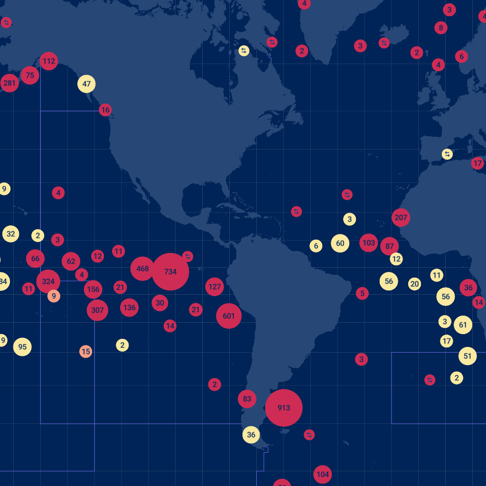

# Render a static image from a mapbox-gl style spec

Using [mapbox-gl-native](https://github.com/mapbox/mapbox-gl-native) and [blog post](https://medium.com/@brendan_ward/creating-a-static-map-renderer-using-the-mapbox-gl-native-nodejs-api-23db560b219e) as reference to create static images from mapbox-gl styles

## Usage

### Installation

```bash
yarn
```

### Render test.png image from [Carrier Portal](https://globalfishingwatch.org/carrier-portal/) style

```bash
yarn start
```


